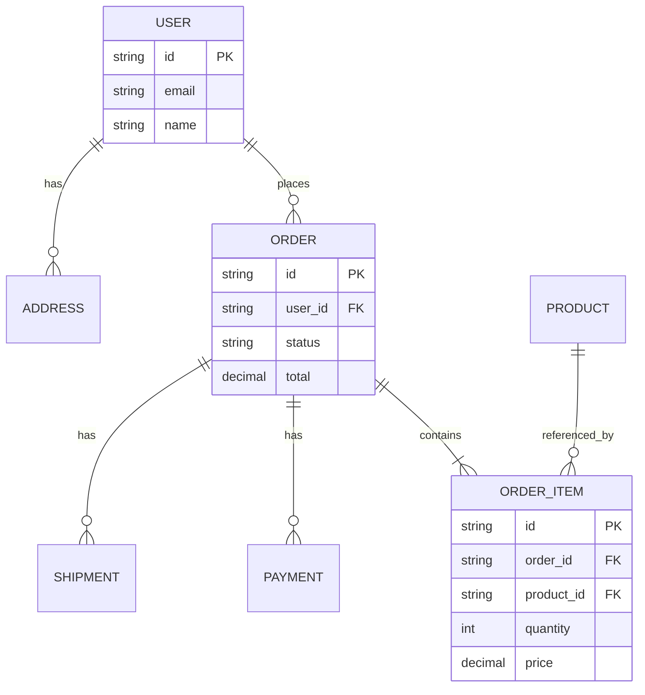

# REST 资源建模

参考来源：Roy Fielding《Architectural Styles》、[REST API Design Best Practices](https://restfulapi.net/)

## 适用场景

- API 设计的第一步
- 把业务对象抽象为可寻址资源
- 复杂业务对象的关系建模
- 决定资源粒度

## 不适用场景

- RPC 风格 API（不需要资源建模）
- GraphQL（用 schema 建模）

## 核心原则

```text
1. 资源是名词，不是动词
   ✅ /users
   ❌ /createUser

2. 资源粒度合适
   不要太大（包含太多无关字段）
   不要太细（每个字段都成资源）

3. 资源对应业务对象
   从用户视角看是什么，资源就是什么
   不是从数据库表照搬

4. 资源关系清晰
   通过路径表达从属关系
   /users/123/orders 表示用户 123 的订单
```

## 四种资源模式

### 1. 集合（Collection）

```text
/resources

GET    /resources         查询列表
POST   /resources         创建新资源

例：
  GET  /users           查询用户列表
  POST /users           创建用户
```

### 2. 单资源（Singleton）

```text
/resources/{id}

GET    /resources/{id}    查询单个
PUT    /resources/{id}    完全替换
PATCH  /resources/{id}    部分更新
DELETE /resources/{id}    删除

例：
  GET    /users/123      查询用户 123
  PATCH  /users/123      更新用户 123
```

### 3. 子资源（Sub-resource）

```text
/resources/{id}/sub-resources

例：
  /users/123/orders             用户 123 的订单
  /orders/456/items             订单 456 的商品
  /projects/789/members         项目 789 的成员
```

### 4. 动作端点（Actions）

```text
当无法用状态变更自然表达时使用

/resources/{id}/actions/{action}

例：
  POST /orders/123/cancel       取消订单
  POST /users/123/reset-password 重置密码
  POST /reports/456/export      导出报表
```

## 资源命名规范

```text
✅ 好的：
  - 复数形式（users / orders / products）
  - 小写 + 连字符（reset-password）
  - 名词

❌ 差的：
  - 单数（user / order）
  - 驼峰（ResetPassword）
  - 动词（getUser / createOrder）
```

## 建模示例

### 业务：电商订单系统

```text
业务对象：
  - 用户 User
  - 商品 Product
  - 订单 Order
  - 订单项 OrderItem
  - 支付 Payment
  - 发货 Shipment

资源建模：

集合：
  /users
  /products
  /orders

单资源：
  /users/{id}
  /products/{id}
  /orders/{id}

子资源（用户的）：
  /users/{id}/orders            用户的订单
  /users/{id}/addresses         用户的地址

子资源（订单的）：
  /orders/{id}/items            订单项
  /orders/{id}/payments         订单支付记录
  /orders/{id}/shipments        发货记录

动作端点：
  POST /orders/{id}/cancel      取消订单
  POST /orders/{id}/refund      申请退款
  POST /orders/{id}/confirm     确认收货

注意：OrderItem 不需要顶层 /order-items
  它只在订单上下文中有意义
```

## 资源关系图



## 输出格式

```markdown
## 资源建模：[业务模块]

### 业务对象清单

| 对象 | 业务含义 | 是否独立资源 |
|------|---------|------------|
| User | 用户 | 是（顶层） |
| Order | 订单 | 是（顶层） |
| OrderItem | 订单项 | 否（订单子资源） |

### 资源端点清单

| 资源 | 路径 | 说明 |
|------|------|------|
| 用户集合 | /users | 用户列表和创建 |
| 单用户 | /users/{id} | 用户详情和修改 |
| 用户订单 | /users/{id}/orders | 某用户的订单 |
| 订单集合 | /orders | 全部订单 |
| 单订单 | /orders/{id} | 订单详情 |
| 订单项 | /orders/{id}/items | 订单内的商品 |
| 取消订单 | POST /orders/{id}/cancel | 动作端点 |

### 资源关系图

[Mermaid ER 图]

### 关键决策

- OrderItem 不做顶层资源（不独立有意义）
- 用户地址作为子资源 /users/{id}/addresses
- 取消订单用动作端点（不是 PATCH status）
```

## 工作流程

```text
1. 列出业务对象
2. 判断哪些是顶层资源
3. 判断哪些是子资源（不独立）
4. 列出资源关系（一对多 / 多对多）
5. 命名资源（复数 + 小写）
6. 识别需要动作端点的场景
7. 画 ER 关系图
8. 输出资源端点清单
9. 转交 endpoint-design 设计具体端点
```

## 质量自检

```text
□ 资源是名词不是动词
□ 复数命名一致
□ 小写 + 连字符
□ 子资源是否真的不独立
□ 是否避免了过深嵌套（不超过 3 层）
□ 动作端点是否真的无法用 CRUD 表达
□ ER 关系图是否完整
```

## 常见坑

1. **从数据库表照搬**——所有表都是顶层资源
2. **资源是动词**——/getUser / /createOrder
3. **嵌套太深**——/users/123/orders/456/items/789/refunds/0
4. **强行用 CRUD**——/orders/{id} PATCH {status: "cancelled"} 不如 /orders/{id}/cancel
5. **子资源独立化**——/order-items 顶层资源（脱离订单无意义）
6. **命名混乱**——单复数混用 / 大小写混用

## 配套模板

- `templates/resource-model-template.md` — 资源建模 + ER 图模板

## 与其他 skill 的协作

```text
上游：
  product-manager 的业务实体清单
  database-engineer 的实体关系（参考但不照搬）

下游：
  endpoint-design → 设计每个资源的端点
  request-response → 设计字段
```
