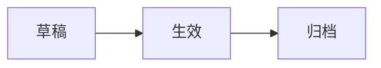

# REST 资源模型模板

## 1. 资源清单

| 资源名 | Path 片段 | 含义 | 所属模块 | 是否对外暴露 |
|---|---|---|---|---|
|  |  |  |  |  |

---

## 2. 资源关系

| 父资源 | 子资源 | 关系 | 示例路径 |
|---|---|---|---|
|  |  |  |  |

---

## 3. 资源状态

| 资源 | 状态 | 含义 | 可执行操作 | 下一个状态 |
|---|---|---|---|---|
|  |  |  |  |  |

---

## 4. 生命周期



---

## 5. 动作化端点例外

仅当资源状态变化无法自然表达为 CRUD 时使用动作化端点。

| 动作 | 资源 | 建议路径 | 为什么不能用标准 CRUD |
|---|---|---|---|
|  |  |  |  |

---

## 6. 命名规则

```text
集合路径使用复数名词。
资源 ID 放在 path 中。
筛选、排序、分页放在 query 中。
动作端点必须说明副作用和幂等性。
```
