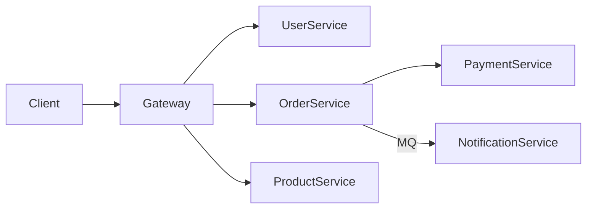

# 微服务架构设计方案模板

## 基本信息

- 项目名：
- 当前状态：单体 / 模块化单体 / 微服务
- 团队规模：
- 预期 QPS：

## 服务拆分

| 服务名 | 职责 | 技术栈 | 数据库 | 通信方式 |
|--------|------|--------|--------|---------|
| | | | | |

## 架构图

## 通信方案

| 调用方 | 被调用方 | 协议 | 同步/异步 | 超时 |
|--------|---------|------|----------|------|
| | | | | |

## 分布式事务

| 场景 | 涉及服务 | 方案 | 补偿机制 |
|------|---------|------|---------|
| | | | |

## 基础设施

- [ ] API 网关：
- [ ] 服务发现：
- [ ] 配置中心：
- [ ] 消息队列：
- [ ] 链路追踪：
- [ ] 日志聚合：
