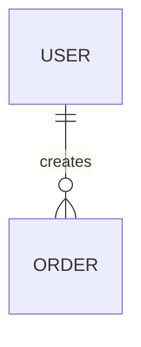

# 数据库 Schema 设计说明模板

## 背景/目标

- 业务背景：
- 设计目标：
- 适用范围：

## 输入依据

| 来源 | 内容 | 状态 |
|------|------|------|
| PRD |  |  |
| API 契约 |  |  |
| 现有表结构 |  |  |
| 查询场景 |  |  |

## 实体与关系



| 实体 | 说明 | 生命周期 | 备注 |
|------|------|----------|------|
|  |  |  |  |

## 表结构

### 表：`table_name`

| 字段 | 类型 | 必填 | 默认值 | 约束 | 说明 |
|------|------|------|--------|------|------|
| id | bigint | 是 | - | primary key | 主键 |

## 约束设计

| 约束 | 字段 | 类型 | 说明 |
|------|------|------|------|
|  |  | primary/foreign/unique/check |  |

## 索引方案

| 索引 | 字段 | 类型 | 对应查询场景 |
|------|------|------|--------------|
|  |  |  |  |

## 查询场景

| 场景 | 条件 | 排序 | 频率 | 性能目标 |
|------|------|------|------|----------|
|  |  |  |  |  |

## 迁移方案

- 新建表：
- 字段新增：
- 存量数据处理：
- 发布顺序：

## 回滚方案

- 回滚触发条件：
- 回滚步骤：
- 数据恢复方式：

## 风险说明

| 风险 | 影响 | 缓解措施 |
|------|------|----------|
|  |  |  |

## 验证清单

```text
□ DDL 可执行
□ 约束符合业务规则
□ 索引覆盖核心查询
□ 迁移和回滚路径明确
□ 后端/API 字段语义一致
```

## 待确认问题

- [ ] 
