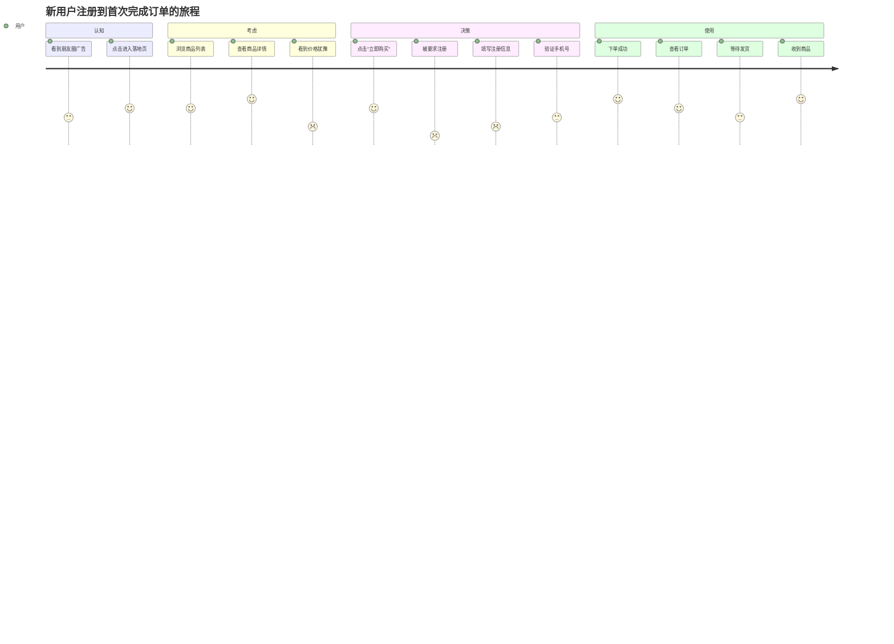

# 用户旅程地图（Customer Journey Map）

参考来源：[Nielsen Norman Group](https://www.nngroup.com/articles/journey-mapping-101/)

## 适用场景

- 新产品/新功能的全流程设计
- 识别用户痛点和改进机会
- 给 UI/UX 工作流提供设计输入
- 跨部门协作（产品/设计/客服/销售）的对齐工具

## 不适用场景

- 单功能小迭代（不需要全流程视角）
- 内部工具（用户路径简单）
- 紧急修复（直接处理）

## 核心结构

```text
阶段（Stages）：用户经历的大阶段
  ↓
触点（Touchpoints）：每个阶段通过什么渠道接触
  ↓
行为（Actions）：用户在做什么
  ↓
情绪（Emotions）：满意 / 中性 / 痛苦
  ↓
痛点（Pain Points）：遇到什么问题
  ↓
机会（Opportunities）：可以改善什么
```

## 标准 5 阶段模板

```text
1. 认知（Awareness）
   用户怎么知道我们的产品？
   触点：广告、SEO、口碑、推荐

2. 考虑（Consideration）
   用户怎么决定要不要试？
   触点：官网、评价、对比文章

3. 决策（Decision）
   用户怎么完成首次注册/购买？
   触点：注册流程、试用、客服

4. 使用（Usage）
   用户怎么用产品？
   触点：核心功能、引导、帮助文档

5. 留存/推荐（Retention/Advocacy）
   用户为什么会继续用 / 推荐给别人？
   触点：通知、社区、激励
```

## Mermaid Journey 输出格式



注：评分 1~5（1 = 痛苦，5 = 满意）

## Markdown 表格输出格式（更详细）

```markdown
## 用户旅程：新用户注册到首次下单

### 用户画像
- 角色：第一次访问的潜在用户
- 场景：通过朋友推荐进入网站
- 目标：买一件性价比高的衣服

### 旅程详情

| 阶段 | 触点 | 用户行为 | 情绪 | 痛点 | 改进机会 |
|------|------|---------|------|------|---------|
| 认知 | 朋友分享链接 | 点击进入 | 😊 | - | - |
| 考虑 | 商品列表页 | 浏览 10+ 商品 | 😊 | 不知道选哪个 | 加智能推荐 |
| 考虑 | 商品详情页 | 查看图片和评价 | 😐 | 评价信息分散 | 评价摘要 |
| 决策 | 加入购物车 | 点击购买 | 😊 | - | - |
| 决策 | 注册页面 | 被强制注册 | 😡 | 流程太长 | 游客下单 / 一键注册 |
| 决策 | 验证手机 | 等待短信 | 😐 | 短信延迟 | 备用验证方式 |
| 决策 | 填写地址 | 手动输入 | 😐 | 太繁琐 | 自动定位 |
| 决策 | 选择支付 | 选微信支付 | 😊 | - | - |
| 使用 | 订单详情 | 查看订单 | 😊 | - | - |
| 使用 | 等待发货 | 查物流 | 😐 | 物流信息不及时 | 实时推送 |
| 使用 | 收到商品 | 查看包装 | 😊 | - | - |
| 留存 | 评价提醒 | 写评价 | 😊 | - | - |
| 留存 | 优惠券通知 | 二次下单 | 😊 | - | - |

### 关键痛点 Top 3

1. **强制注册**：30% 用户在这里流失
2. **地址填写繁琐**：平均花 2 分钟
3. **物流信息延迟**：客服日均 50+ 投诉

### 优先改进建议

P0：游客下单 + 一键注册
P1：地址自动定位
P2：物流实时推送
```

## 工作流程

```text
1. 选定一个用户角色和具体场景
   ↓
2. 列出所有阶段（不要少于 3 个）
   ↓
3. 每个阶段填充：
   - 触点（在哪里发生）
   - 行为（用户做什么）
   - 情绪（用 emoji 或评分）
   ↓
4. 识别痛点（情绪 ≤ 2 的地方）
   ↓
5. 每个痛点提出 1~3 个改进机会
   ↓
6. 优先级排序（按影响和成本）
   ↓
7. 转交 UI/UX / 项目经理 / 数据分析
```

## 数据来源

```text
真实数据来源：
  - 用户访谈（最有价值）
  - 客服记录（痛点最集中）
  - 用户行为埋点
  - NPS / 满意度调研
  - 客户成功 case

避免：
  - 团队凭空想象
  - 从竞品照搬
  - 一次性产物（应该持续更新）
```

## 质量自检

```text
□ 用户角色是否具体（不是"所有用户"）
□ 场景是否具体（不是"使用产品"）
□ 阶段是否覆盖完整（认知到留存）
□ 每个阶段是否有触点和行为
□ 情绪是否标注了（有些痛点不在功能上而在情绪上）
□ 痛点是否有数据支持（不是猜测）
□ 改进机会是否有优先级
□ 是否真正为下游工作流提供了输入
```

## 常见坑

1. **只画完美路径**——忽略用户卡住、流失的地方
2. **没有痛点**——团队太乐观，看不到问题
3. **痛点没有数据**——凭感觉说"这里不好"
4. **改进机会就是堆功能**——没有优先级
5. **一次性产物**——画完就放着，不更新
6. **没有用户研究**——团队闭门造车
7. **阶段太少**——只画"使用"，忽略前后

## 配套模板

- `templates/persona-journey-template.md` — 用户画像 + Markdown 表格旅程 + Mermaid journey 模板

## 与其他 skill 的协作

```text
上游：
  positioning → 提供目标用户定义
  pr-faq → 提供产品愿景

平行：
  opportunity-tree → 旅程中的痛点 = 机会的输入

下游：
  转交 UI/UX → 设计每个阶段的页面和交互
  转交数据分析 → 设计漏斗分析
  转交客服 → 优化用户接触点
  转交项目经理 → 按改进优先级拆排期
```
