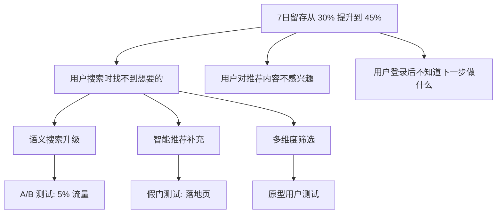

# 机会解决方案树（Opportunity Solution Tree）

参考来源：Teresa Torres《Continuous Discovery Habits》

## 适用场景

- 业务目标明确，但不知道该做什么功能
- 候选方案太多，不知道选哪个
- 团队对"用户痛点是什么"有分歧
- 高不确定性需求探索（在写 PRD 之前）
- 持续用户研究的产出整理

## 不适用场景

- 需求已经明确，只需要写 PRD（直接用 [prd-writing](../prd-writing/SKILL.md)）
- 单功能小迭代（直接用 [user-story](../user-story/SKILL.md)）
- 紧急 bug 修复（不需要探索）

## 核心思想

**先发散机会，再收敛方案。先验证假设，再投入开发。**

OST 是一个树状结构，从产品目标出发，逐层分解为：
- 用户机会（痛点/需求/期望）
- 候选方案
- 验证实验

```text
[产品目标 / Outcome]
    ↓
┌───┴───┐
│机会 A │ ← 用户的痛点/需求
└───┬───┘
    ↓
┌───┴───┐ ┌───────┐
│方案 A1│ │方案 A2│ ← 解决这个痛点的不同方式
└───┬───┘ └───┬───┘
    ↓         ↓
[实验 A1a] [实验 A2a] ← 验证方案可行的最小成本测试
```

## 四层结构

### 1. Outcome（产品目标）

可量化的业务结果，不是"做什么"而是"达到什么"。

```text
✅ 好的：
  - 7 日留存从 X% 提升到 Y%
  - 月活用户从 1 万到 5 万
  - 客单价从 50 元提升到 80 元

❌ 差的：
  - 提升用户体验
  - 让产品更好用
  - 增加用户活跃度（没有数字）
```

### 2. Opportunities（机会）

用户视角的痛点、需求、期望。**用用户语言，不用解决方案语言**。

```text
✅ 好的：
  - "我搜索商品时找不到想要的"
  - "我下单时不确定能不能按时收到"
  - "我退款流程太复杂不想再买"

❌ 差的：
  - "需要搜索算法优化"（解决方案）
  - "改进物流系统"（解决方案）
  - "退款一键操作"（解决方案）
```

机会必须有证据：用户访谈、客服记录、行为数据、问卷。

### 3. Solutions（候选方案）

解决某个机会的具体方式。**一个机会下应该有多个方案候选，不是只有一个**。

```text
机会："我搜索商品时找不到想要的"
方案候选：
  - 搜索算法升级（语义搜索）
  - 智能推荐补充（"找不到？试试这些"）
  - 分类导航优化
  - 多维度筛选器
  - 视觉搜索（拍照搜图）
```

### 4. Experiments（验证实验）

在投入完整开发前，用最小成本验证方案是否可行。

详见 [pol-probe](../pol-probe/SKILL.md) skill。

## 工作流程

```text
1. 明确 Outcome（必须可量化）
   ↓
2. 收集用户洞察（访谈/数据/客服记录）
   ↓
3. 识别用户机会（用户语言，至少 5~10 个）
   ↓
4. 按重要性筛选 Top 3 机会
   ↓
5. 每个机会下生成 3+ 个候选方案
   ↓
6. 每个方案设计 1 个最小验证实验
   ↓
7. 优先执行成本最低、信息量最大的实验
   ↓
8. 实验结果反馈到树上 → 决定继续 / 调整 / 放弃
```

## 输出格式（Mermaid）



## 输出格式（Markdown）

```markdown
## OST: 提升 7 日留存

### Outcome（目标）

7 日留存从 30% 提升到 45%（季度目标）

### Opportunities（机会）

#### Op1: "我搜索商品时找不到想要的"
- 证据：客服记录显示每周 200+ 次"找不到"投诉
- 优先级：高
- 影响留存：中

#### Op2: "我对推荐内容不感兴趣"
- 证据：推荐位 CTR 仅 2%（行业平均 5%）
- 优先级：高
- 影响留存：高

#### Op3: "我登录后不知道下一步做什么"
- 证据：新用户 D1 跳出率 60%
- 优先级：中
- 影响留存：高

### Solutions（候选方案）

#### Op1 的方案
| # | 方案 | 成本 | 影响 | 推荐 |
|---|------|------|------|------|
| S1 | 语义搜索升级 | 高 | 高 | ⭐⭐⭐ |
| S2 | 智能推荐补充 | 中 | 中 | ⭐⭐ |
| S3 | 多维度筛选 | 低 | 中 | ⭐⭐⭐ |

#### Op2 的方案
...

### Experiments（验证实验）

| 实验 | 类型 | 验证什么 | 成本 | 时间 |
|------|------|---------|------|------|
| E1 | A/B 测试 | 语义搜索 vs 关键词搜索的 CTR | 中 | 30min |
| E2 | 假门测试 | 智能推荐的接受度 | 低 | 15min |

### 下一步

优先执行 E2（成本最低，信息量大）
```

## 质量自检

```text
□ Outcome 是否可量化（有具体数字）
□ Opportunities 是否用了用户语言（不是解决方案语言）
□ 每个 Opportunity 是否有证据支持（不是凭空想象）
□ 每个 Opportunity 下是否有 3+ 个候选方案
□ 每个方案是否有验证实验（不是直接投入开发）
□ 是否优先执行成本最低、信息量最大的实验
```

## 常见坑

1. **跳过 Opportunity 直接做 Solution**——"用户需要 AI 推荐" → 应该先问"用户的痛点是什么"
2. **Opportunity 写成解决方案**——"需要搜索升级" → 应该是"用户找不到想要的"
3. **每个机会只有一个方案**——失去了横向对比的机会
4. **没有证据支持机会**——团队拍脑袋想出来的痛点
5. **Outcome 不可量化**——"提升体验" → 无法验证是否达成
6. **不验证就开始开发**——绕过实验直接投入完整功能
7. **树是一次性的**——OST 应该随着实验结果持续更新

## 配套模板

- `templates/opportunity-solution-tree-template.md` — OST 完整模板
- `templates/discovery-brief-template.md` — 机会证据收集模板

## 与其他 skill 的协作

```text
上游：
  用户研究 / 数据分析 / 客服反馈

平行：
  pol-probe → 设计每个方案的验证实验
  prioritization → 当方案太多时，用 RICE/ICE 排序

下游：
  实验通过 → mvp-scoping 划分范围
  范围确定 → prd-writing 输出 PRD
```
