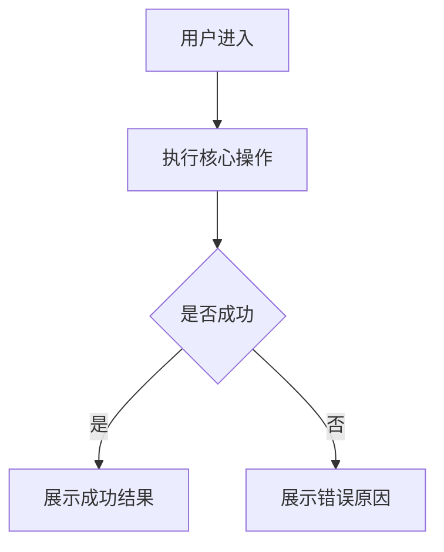

# PRD 模板

## 1. 文档信息

```text
产品/功能名称：
版本：
负责人：
创建日期：
更新日期：
状态：草稿 / 发现中 / 评审中 / 已确认 / 已废弃
```

---

## 2. 背景

说明为什么要做这个需求。

```text
当前现状：
用户问题：
业务机会：
不做的影响：
证据来源：用户反馈 / 数据 / 竞品 / 业务方要求 / 假设
```

---

## 3. 目标

### 业务目标

```text
目标 1：
目标 2：
目标 3：
```

### 用户目标

```text
用户希望完成什么：
用户希望减少什么成本：
用户希望获得什么价值：
```

### 成功指标

| 指标 | 当前值 | 目标值 | 观察周期 | 数据来源 |
|---|---|---|---|---|
| | | | | |

---

## 4. 产品发现

### 用户需求

```text
目标用户：
使用场景：
当前痛点：
当前替代方案：
待解决任务：
```

### 机会点

| 机会点 | 用户问题 | 证据 | 影响范围 | 优先级 |
|---|---|---|---|---|
| | | | | |

### 关键假设

| 假设 | 类型 | 验证方式 | 成功标准 | 状态 |
|---|---|---|---|---|
| | 价值 / 可用性 / 可行性 / 商业可行性 | | | 待验证 / 已验证 / 暂缓 |

---

## 5. 目标用户和场景

| 用户角色 | 场景 | 当前痛点 | 期望结果 |
|---|---|---|---|
| | | | |

---

## 6. 范围

### 本版本做

```text
1.
2.
3.
```

### 本版本不做

```text
1.
2.
3.
```

### 后续版本考虑

```text
1.
2.
3.
```

---

## 7. 用户流程



---

## 8. 功能需求

| 编号 | 功能 | 用户故事 | 优先级 | 说明 |
|---|---|---|---|---|
| F001 | | | Must | |

---

## 9. 业务规则

```text
规则 1：
规则 2：
规则 3：
```

---

## 10. 角色和权限

| 角色 | 查看 | 创建 | 编辑 | 删除 | 审批 | 备注 |
|---|---|---|---|---|---|---|
| 普通用户 | | | | | | |
| 管理员 | | | | | | |

---

## 11. 状态和异常

| 场景 | 系统行为 | 用户提示 | 下游影响 |
|---|---|---|---|
| 成功 | | | |
| 空数据 | | | |
| 参数错误 | | | |
| 权限不足 | | | |
| 网络异常 | | | |
| 重复提交 | | | |

---

## 12. 数据需求

```text
核心实体：
关键字段：
数据来源：
数据生命周期：
是否涉及敏感数据：是 / 否
```

---

## 13. 接口需求

```text
需要新增接口：
需要修改接口：
第三方依赖：
鉴权要求：
错误码要求：
```

---

## 14. 验收标准

```gherkin
Given 前置条件
When 用户执行某操作
Then 系统产生可验证结果
```

| 编号 | 验收标准 | 关联功能 | 优先级 |
|---|---|---|---|
| AC001 | | F001 | Must |

---

## 15. 指标和埋点

### Goals / Signals / Metrics

| Goal | Signal | Metric | 数据来源 | 观察周期 | 成功标准 |
|---|---|---|---|---|---|
| | | | | | |

### 防护指标

| 防护对象 | 指标 | 阈值 | 说明 |
|---|---|---|---|
| 性能 | | | |
| 安全 | | | |
| 客诉 | | | |
| 成本 | | | |

### 埋点建议

| 事件 | 触发时机 | 属性 | 用途 |
|---|---|---|---|
| | | | |

---

## 16. 路线图和 Backlog

| 阶段 | 目标 | 能力 | 成功指标 | 依赖 | 风险 |
|---|---|---|---|---|---|
| V1 | | | | | |
| V2 | | | | | |
| Later | | | | | |

---

## 17. 风险和依赖

| 类型 | 描述 | 影响 | 应对方案 | 负责人 |
|---|---|---|---|---|
| 价值 | | | | |
| 可用性 | | | | |
| 技术 | | | | |
| 安全 | | | | |
| 商业可行性 | | | | |
| 交付 | | | | |

---

## 18. 未决问题

| 问题 | 影响 | 负责人 | 截止时间 | 状态 |
|---|---|---|---|---|
| | | | | |

---

## 19. 下游交付

| 工作流 | 需要交付的内容 |
|---|---|
| 项目经理 | 功能清单、优先级、风险、路线图 |
| UI/UX | 用户流程、页面目标、状态、用户旅程 |
| API 设计 | 资源、操作、权限、错误场景 |
| 数据库 | 实体、关系、数据生命周期 |
| 前端 | 页面、交互、验收标准 |
| 后端 | 业务规则、权限、状态流转 |
| QA | 验收标准、异常场景 |
| 安全 | 权限、敏感数据、风险场景 |
| 数据分析 | 指标、埋点、观察周期 |
