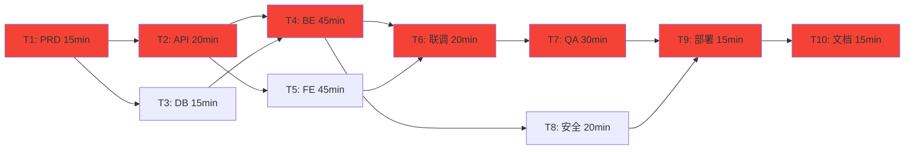

# 关键路径分析（Critical Path Method）

## 适用场景

- WBS 任务分解后的下一步
- 找出项目最长依赖链路
- 识别可并行的任务组
- 估算项目最短工期
- 决定哪些任务需要重点监控

## 核心概念

```text
关键路径 = 项目中最长的依赖链路
任何关键路径上的延迟 = 项目延期
非关键路径 = 有时间裕度（slack/float），延迟一定时间不影响整体

关键路径上的任务必须：
  - 不能有空闲缓冲
  - 必须优先分配资源
  - 必须重点监控
  - 出现风险时优先处理
```

## 依赖类型

```text
FS（Finish-to-Start，完成-开始）：
  最常见，A 完成后 B 才能开始
  例：API 设计完成 → 后端开发开始

SS（Start-to-Start，开始-开始）：
  A 开始后 B 也可以开始
  例：PRD 完成 → QA 用例设计可以提前开始

FF（Finish-to-Finish，完成-完成）：
  A 完成后 B 才能完成
  例：开发完成 → 文档才能定稿

外部依赖：
  不受项目控制的等待
  例：等待第三方 API 申请、等待证书签发
```

## 关键路径识别步骤

```text
1. 列出所有任务和依赖（来自 wbs-decomposition）
   ↓
2. 画 DAG 依赖图
   ↓
3. 计算每个任务的最早开始时间（ES）
   ↓
4. 计算每个任务的最晚开始时间（LS）
   ↓
5. Slack = LS - ES
   - Slack = 0 → 关键路径上
   - Slack > 0 → 非关键路径，有裕度
   ↓
6. 标记关键路径
   ↓
7. 识别可并行的任务组
```

## 示例

```text
任务列表：
T1: PRD 评审（15min，无依赖）
T2: API 契约（20min，依赖 T1）
T3: 数据库设计（15min，依赖 T1）
T4: 后端开发（45min，依赖 T2, T3）
T5: 前端开发（45min，依赖 T2）
T6: 联调（20min，依赖 T4, T5）
T7: QA 测试（30min，依赖 T6）
T8: 安全检查（20min，依赖 T4）
T9: 部署（15min，依赖 T7, T8）
T10: 文档（15min，依赖 T9）
```



```text
关键路径：T1 → T2 → T4 → T6 → T7 → T9 → T10
总工期 = 15 + 20 + 45 + 20 + 30 + 15 + 15 = 160min ≈ 2h40min

并行机会：
  - T2 和 T3 可并行（都依赖 T1，互不依赖）
  - T4 和 T5 可并行（前提：API 契约已确定）
  - T7 和 T8 可并行（QA 和安全互不依赖）

裕度：
  - T3：5min 裕度（T2 是 20min，T3 是 15min）
  - T5：0min（T4 完成后 T6 才开始，T5 必须在 T4 之前完成）
  - T8：30min 裕度（T7+T9 是 45min，T8 是 20min）
```

## 输出格式

```markdown
## 关键路径分析

### 关键路径
T1 → T2 → T4 → T6 → T7 → T9 → T10
**总工期：160min（2h40min）**

### 并行执行组
- 设计阶段：T2 (API) + T3 (DB) 并行
- 开发阶段：T4 (后端) + T5 (前端) 并行
- 验证阶段：T7 (QA) + T8 (安全) 并行

### 任务裕度（Slack）
| 任务 | 裕度 | 备注 |
|------|------|------|
| T3 | 5min | 比关键路径上的 T2 短 |
| T8 | 30min | 比关键路径上的 T7 短 |
| T5 | 0min | 关键路径上 |

### 风险提示
- T4 是高耗时关键任务（45min），任何延迟直接影响整体
- 建议为 T4 预留 15min 缓冲
- T2/T3 并行节省 15min，但要确保依赖正确
```

## 工作流程

```text
1. 读取 WBS 任务清单（来自 wbs-decomposition）
   ↓
2. 画依赖 DAG
   ↓
3. 计算每条路径总工期
   ↓
4. 找出最长路径 = 关键路径
   ↓
5. 计算非关键路径任务的 Slack
   ↓
6. 标记可并行组
   ↓
7. 输出关键路径报告
   ↓
8. 转交 orchestration skill 决定编排模式
```

## 质量自检

```text
□ DAG 是否完整（每个任务都画了）
□ 关键路径是否唯一明确
□ 并行组是否真的可以并行（不是有隐藏依赖）
□ 是否标注了任务裕度
□ 总工期是否合理（不要太乐观）
□ 是否考虑了缓冲时间
```

## 常见坑

1. **把所有任务都标为关键路径**——没有识别裕度的意义
2. **隐藏依赖**——前后端都依赖 API 契约但忘记标
3. **只看任务工期，不看资源**——同一个工作流不能同时执行两个任务
4. **不留缓冲**——关键路径上必须有缓冲，否则一个延误就崩
5. **DAG 有环**——A 依赖 B，B 依赖 A → 不可能完成
6. **忘记外部依赖**——第三方审批可能比开发还久

## 配套模板

- `templates/task-dag-template.md` — Mermaid DAG + 关键路径报告模板

## 与其他 skill 的协作

```text
上游：
  wbs-decomposition → 提供任务列表和依赖

下游：
  orchestration → 用关键路径决定编排模式
  risk-management → 关键路径上的任务优先评估风险
  milestone-gate → 关键路径节点是天然的里程碑
  progress-tracking → 关键路径任务重点监控
```
