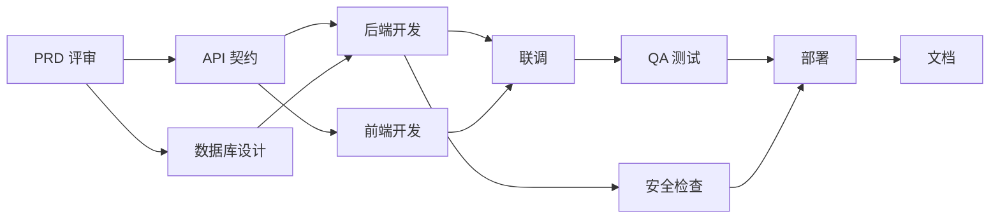

# 任务依赖图模板

## 1. 关键路径说明

```text
关键路径：
总预计工期：
可并行任务组：
外部依赖：
```

## 2. Mermaid DAG



## 3. 依赖表

| 任务 | 前置依赖 | 依赖类型 | 是否关键路径 | 说明 |
|---|---|---|---|---|
| | | FS / SS / FF / 外部 | 是 / 否 | |

## 4. 并行安全检查

```text
是否会同时修改同一文件？
是否依赖同一个未稳定契约？
是否有明确合并策略？
是否有冲突处理规则？
```
