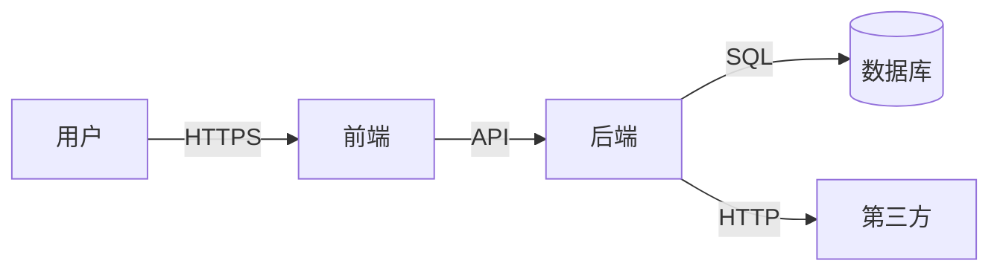

# 威胁模型模板

## 系统信息
```text
系统/功能：
版本：
评审日期：
参与人：
```

## 数据流图（DFD）


## 信任边界
```text
边界 1：用户 ↔ 前端（不可信输入）
边界 2：前端 ↔ 后端（需认证）
边界 3：后端 ↔ 数据库（需授权）
边界 4：后端 ↔ 第三方（需签名）
```

## STRIDE 分析

| 数据流 | 威胁类型 | 威胁描述 | 风险 | 缓解措施 | 状态 |
|---|---|---|---|---|---|
| 用户→前端 | S | JWT 伪造 | 高 | 签名验证 + 短过期 | ✅ |
| 用户→前端 | T | XSS 注入 | 高 | CSP + 转义 | ✅ |
| 前端→后端 | I | Token 泄露 | 中 | HttpOnly Cookie | ✅ |
| 后端→DB | E | SQL 注入提权 | 高 | 参数化查询 | ✅ |
| 后端→第三方 | D | 第三方超时 | 中 | 限流 + 降级 | ⏳ |

## 高风险项
| # | 威胁 | 风险 | 缓解 | 负责人 | 截止 |
|---|---|---|---|---|---|
| 1 |  |  |  |  |  |

## 自检
```text
□ DFD 完整
□ 信任边界标注
□ STRIDE 全覆盖
□ 高风险有缓解
□ 与开发评审
□ 定期更新
```
