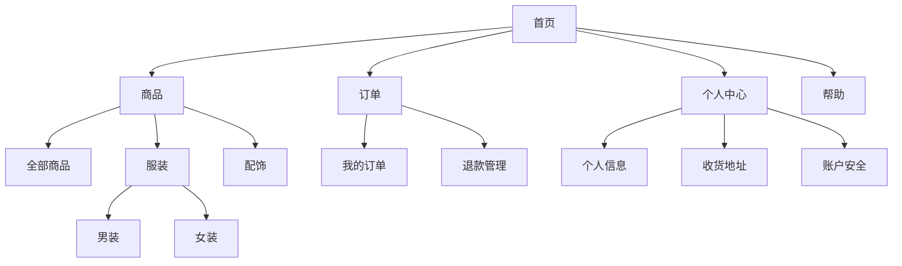

# 信息架构（Information Architecture）

参考来源：Rosenfeld《Information Architecture》、NNGroup IA 方法

## 适用场景

- 多页面产品的整体组织
- 复杂功能模块的内容分组
- 导航和菜单结构设计
- 重新组织已有产品的信息架构

## 核心原则

```text
1. 用户心理模型优先
   按用户怎么找信息组织，不是按团队怎么开发

2. 7±2 原则
   一级菜单不超过 7 项
   一组列表不超过 9 项

3. 一致的命名
   同一概念用同一术语
   不要混用"个人中心"/"我的"/"账户"

4. 层级不要太深
   桌面端：3 层以内
   移动端：2 层以内
```

## 三个核心组件

### 1. 组织系统（Organization）

```text
分类方式：
  - 按主题（产品分类）
  - 按任务（要完成什么）
  - 按用户角色（不同角色看不同的）
  - 按时间（最新/历史）
  - 按字母（A-Z）
  - 按地理位置
```

### 2. 标签系统（Labeling）

```text
要求：
  - 用户语言（不是技术术语）
  - 简洁（2~4 个字）
  - 一致（不混用同义词）
  - 可识别（看到就知道是什么）
```

### 3. 导航系统（Navigation）

```text
导航模式：

全局导航（Global）
  顶部导航栏 / 侧边栏
  适合：主功能模块切换

局部导航（Local）
  二级菜单 / 标签页
  适合：当前模块内的细分

上下文导航（Contextual）
  面包屑 / 相关链接
  适合：表明位置 + 提供回退

工具栏（Utility）
  搜索 / 通知 / 用户头像
  适合：辅助功能
```

## 卡片分类法

```text
1. 列出所有内容/功能（30~50 张卡片）
2. 让 5~10 个用户分组（线下或线上工具）
3. 分析共性 → 形成分类
4. 命名分类（用户语言）
5. 验证（树测试）
```

## 输出格式

### 树状结构

```markdown
## 信息架构

首页
├─ 商品（一级菜单）
│  ├─ 全部商品
│  ├─ 服装
│  │  ├─ 男装
│  │  └─ 女装
│  └─ 配饰
├─ 订单
│  ├─ 我的订单
│  └─ 退款管理
├─ 个人中心
│  ├─ 个人信息
│  ├─ 收货地址
│  └─ 账户安全
└─ 帮助
```

### Mermaid 图



## 工作流程

```text
1. 收集所有内容/功能（来自 PRD）
2. 进行卡片分类（理想 5~10 个用户参与）
3. 提炼分类
4. 命名分类（用户语言）
5. 设计层级（不超过 3 层）
6. 选择导航模式
7. 输出树状结构和 Mermaid 图
8. 转交 page-structure 设计具体页面
```

## 质量自检

```text
□ 一级菜单是否 ≤ 7 项
□ 层级是否 ≤ 3 层
□ 命名是否一致（无同义词混用）
□ 命名是否用户语言（无技术术语）
□ 是否选择了合适的导航模式
□ 是否考虑了移动端的退化
```

## 常见坑

1. **按部门组织信息**——团队结构 vs 用户心理模型
2. **菜单过多**——一级菜单超过 7 项
3. **层级太深**——3 层以上用户找不到
4. **命名混乱**——同一功能多个名字
5. **技术术语**——"实体管理" vs "我的资源"
6. **不验证**——没做卡片分类，凭直觉
7. **忽略移动端**——桌面端的多级菜单在移动端崩溃

## 配套模板

- `templates/information-architecture-template.md` — 树状结构 + 卡片分类记录模板

## 与其他 skill 的协作

```text
上游：
  user-flow → 提供流程节点
  product-manager 的 PRD

下游：
  page-structure → 每个节点设计具体页面
  enterprise-patterns → 复杂导航模式
```
