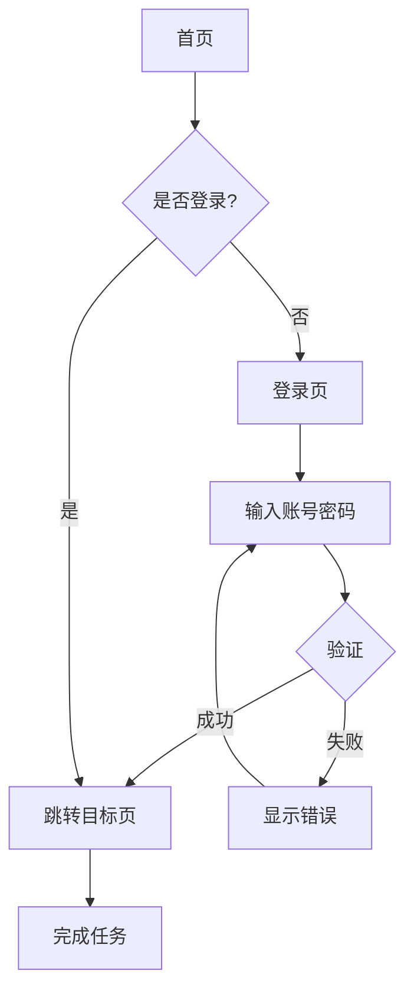

# 用户流程设计

## 适用场景

- 功能流程的步骤梳理
- 页面跳转和决策点设计
- 异常路径和异常恢复设计
- 给信息架构和页面结构提供输入

## 不适用场景

- 单一页面无流程（直接用 page-structure）
- 整体产品架构（用 information-architecture）

## 核心结构

```text
触发点 → 进入 → 浏览 → 决策 → 操作 → 反馈 → 完成 / 失败
```

每个流程必须包含：
- 触发点（用户从哪进入）
- 主路径（最常见的成功路径）
- 决策点（用户需要做选择的地方）
- 异常路径（错误、空数据、权限不足）
- 反馈机制（系统如何回应用户）
- 退出路径（用户如何返回或取消）

## 输出格式

### Mermaid 流程图



### 流程描述模板

```markdown
## 流程：[流程名]

### 触发点
[用户从哪里进入这个流程]

### 主路径（成功路径）
1. 用户 [操作 1]
2. 系统 [反馈 1]
3. 用户 [操作 2]
...

### 决策点
- 决策 1：[条件] → 路径 A / 路径 B
- 决策 2：...

### 异常路径
- 异常 1：[条件] → 处理方式
- 异常 2：...

### 反馈机制
- 加载中：[显示什么]
- 成功：[显示什么 + 自动跳转?]
- 失败：[显示什么 + 是否可重试?]

### 退出路径
- 取消按钮：返回到 [页面]
- 浏览器后退：行为是 [...]
```

## 工作流程

```text
1. 识别用户角色和场景
2. 定义触发点（用户从哪进入）
3. 列出主路径步骤（最简单的成功路径）
4. 在每个步骤识别决策点
5. 为每个决策点设计分支
6. 列出所有异常路径
7. 定义反馈机制
8. 定义退出路径
9. 用 Mermaid 可视化
10. 转交 page-structure 设计具体页面
```

## 质量自检

```text
□ 主路径是否足够短（不要超过 7 步）
□ 是否覆盖了所有决策点
□ 异常路径是否完整
□ 反馈是否在每个关键节点
□ 退出路径是否明确
□ 是否使用 Mermaid 可视化
```

## 常见坑

1. **只画成功路径**——异常路径才是设计的灵魂
2. **决策点不明确**——用户不知道为什么会跳到这里
3. **反馈缺失**——加载中、成功、失败没有反馈
4. **退出路径不清**——用户被困在流程里
5. **流程太长**——超过 7 步必须考虑能否简化
6. **没有可视化**——只用文字描述很难看清

## 配套模板

- `templates/user-flow-template.md` — 流程描述 + Mermaid 流程图模板

## 与其他 skill 的协作

```text
上游：
  product-manager 的 PRD / 用户故事

平行：
  customer-journey（产品经理）→ 提供用户旅程

下游：
  information-architecture → 设计整体架构
  page-structure → 设计具体页面
  component-states → 定义反馈状态
```
