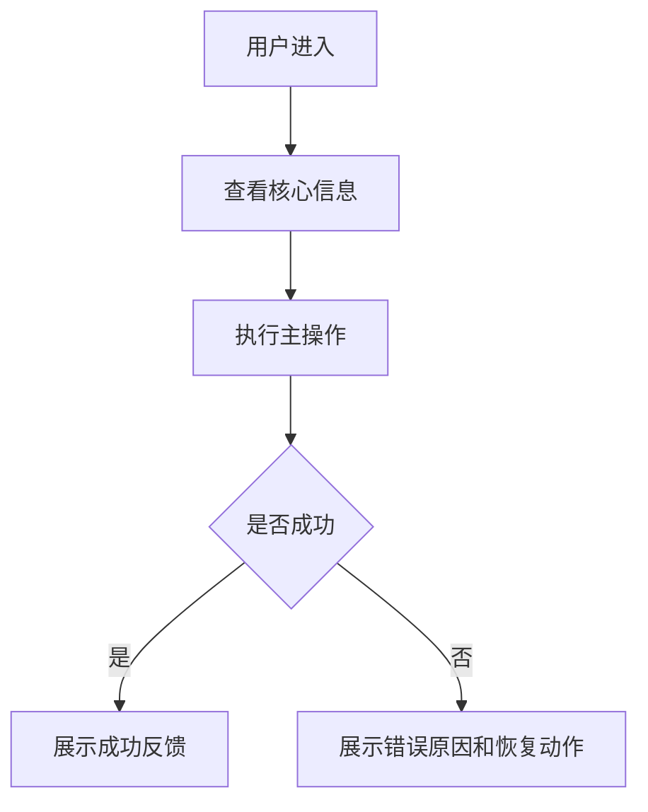

# 用户流程模板

## 1. 流程目标

```text
流程名称：
用户角色：
用户目标：
进入入口：
成功结果：
```

## 2. 主流程



## 3. 步骤说明

| 步骤 | 页面/区域 | 用户动作 | 系统反馈 | 可能异常 |
|---|---|---|---|---|
| 1 | | | | |

## 4. 分支流程

| 分支场景 | 触发条件 | 系统处理 | 用户下一步 |
|---|---|---|---|
| 空数据 | | | |
| 权限不足 | | | |
| 输入错误 | | | |
| 网络失败 | | | |

## 5. 流程检查

```text
主路径是否最短？
失败后是否可恢复？
每一步是否有明确反馈？
用户是否知道下一步做什么？
```
